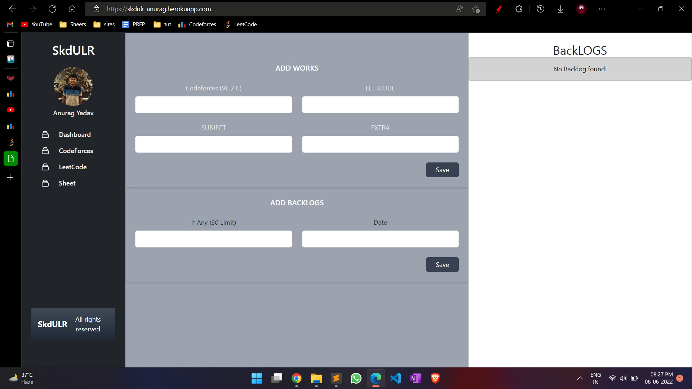
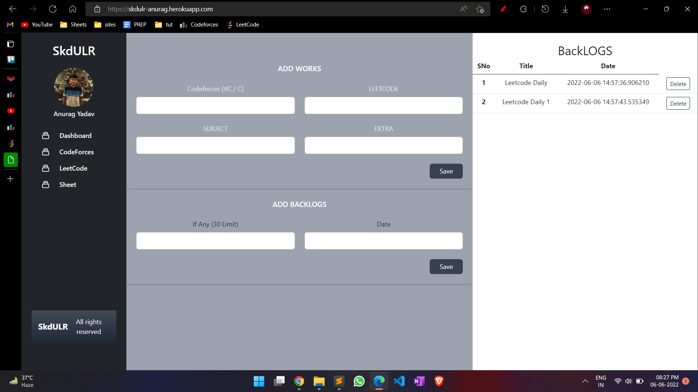

# skdulr

This websites can be used for tracking your work , you can add any backlogs and even what you did today 

This will show real time backlogs status and also you can delete that backlog when you complete that thing 

Main function of this site is to track your progress in coding and it will help you in manage all the stuff related to it 
you can also link your various coding profiles to this site such as Coforces profile and also any doc  

#Some ScreenShots of the App. 
 
 
